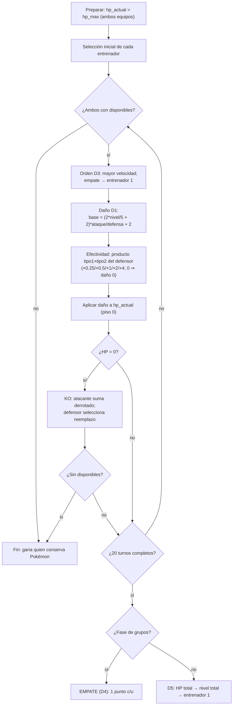
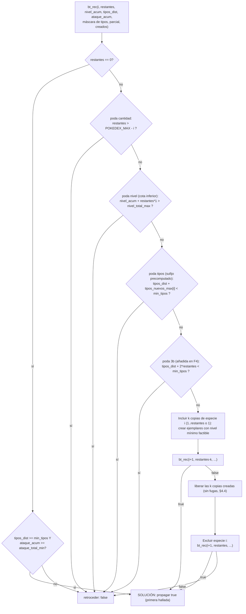
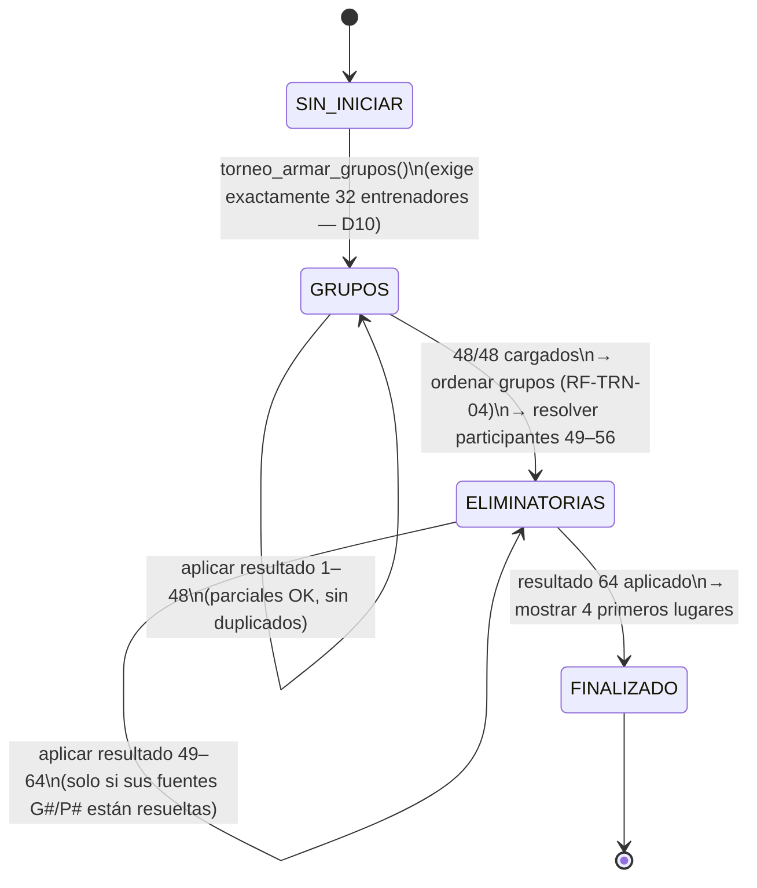
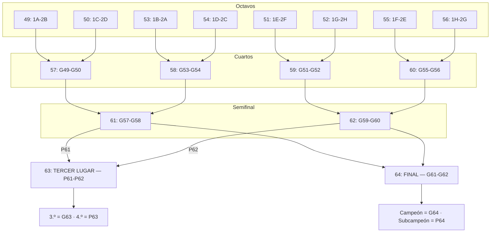
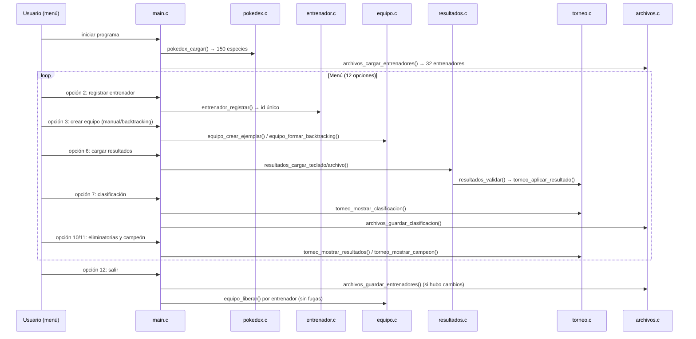

# Informe técnico — El Gran Torneo Pokémon

**Proyecto**: El Gran Torneo Pokémon — Sistema de administración de torneo (Primera Generación)
**Curso**: Programación I / Algoritmos I — Universidad de Carabobo
**Lenguaje**: C (ISO C99) · `gcc -std=c99 -Wall -Wextra` (cero warnings)
**Documento**: DOC-03 (spec `documentacion`) · **Versión final**: F10 (2026-09-21)

Este informe se construyó incrementalmente durante el desarrollo (F0 → F10) y
queda **completo** en esta versión final: decisiones D1–D10 justificadas para la
defensa oral, fórmulas, algoritmos, diagramas finales de arquitectura y flujos,
formatos de archivo, estrategia de verificación y guía de compilación y uso.

---

## 1. Introducción y objetivos

El sistema administra íntegramente un torneo Pokémon de la Liga con la Primera
Generación (150 especies): carga la Pokédex desde archivo, registra entrenadores
con equipos de ejemplares propios, simula combates 1 vs 1 con efectividad de
tipos, organiza la fase de grupos round-robin con su clasificación por desempates
y resuelve la fase eliminatoria de 16 (bracket 49–64) hasta coronar al campeón.

Objetivos de la defensa oral:

1. Demostrar el dominio de **funciones, estructuras, TDA, manejo de archivos,
   cadenas, recursividad y backtracking** en C (punto 3 del enunciado).
2. Justificar **cada decisión de diseño abierta (D1–D10)** con rationale
   técnico y evidencia de verificación.
3. Demostrar **determinismo total**: sin azar en ninguna ruta, con batería de
   pruebas scriptada reproducible (`stdin → stdout → diff`).

---

## 2. Arquitectura del sistema

### 2.1 Mapa de módulos y dependencias (FINAL)

El sistema se organiza en 10 módulos más `main`. `main` solo orquesta el menú y
el flujo (RF-TEC-02); cada módulo tiene una responsabilidad única y las
dependencias solo apuntan "hacia abajo" (sin ciclos entre cabeceras).


Contratos por módulo (resumen de la implementación final):

| Módulo | Responsabilidad única | Líneas |
|---|---|---|
| `main.c` | Menú de 12 opciones (RF-MEN-01), carga inicial, despacho; cero lógica de negocio | 764 |
| `pokedex.c` | Carga estricta de las 150 especies (D8), búsquedas por número/nombre, mostrado | 311 |
| `tipos.c` | Enum de 18 tipos, matriz `float[18][18]` (MINOR-1: vive en `.c`), multiplicador | 307 |
| `entrenador.c` | Registro con id único (RF-ENT-02), búsqueda, listado | 104 |
| `equipo.c` | Ejemplar desde especie (D2), validación (RF-EQP-05), liberación, **backtracking** (RF-EQP-04) | 513 |
| `combate.c` | Daño D1, orden D3, KO/reemplazo (RF-CMB-04), empate D4 / anti-empate D5 | 366 |
| `torneo.c` | Grupos A–H, calendario 1–48, clasificación RF-TRN-04, bracket 49–64, campeón | 798 |
| `resultados.c` | Carga teclado/archivo, validación completa (RF-RES-02), pendientes | 373 |
| `archivos.c` | E/S de `entrenadores.txt`, `resultados.txt`, `clasificacion.txt` | 358 |
| `validacion.c` | Lectura segura con reintentos y EOF (RF-TEC-03), separación de campos | 130 |

### 2.2 Flujo de combate (D1, D3, D4, D5) — FINAL



### 2.3 Backtracking de formación de equipos (RF-EQP-04) — FINAL, con podas reales

La implementación final ramifica sobre **cuántas copias** de la especie `i`
incluir (0..`restantes` si `permitir_repetidas`; 0..1 si no), aplica las podas
del diseño §4.3 **más la poda 3b añadida en el desarrollo** y propaga la primera
solución (salida temprana).



**Poda 3b (desviación documentada)**: el diseño §4.5 daba por cubierto el peor
caso "min_tipos alto" con la poda de sufijo, pero en la verificación se detectó
que una rama con muchos ejemplares pendientes podía seguir explorando cuando ni
siquiera la cota optimista era alcanzable por la cota real de tipos aportados.
Cada ejemplar aporta a lo sumo **2 tipos** (primario + secundario), luego si
`tipos_dist + 2*restantes < min_tipos` la rama es infactible y se corta. Con
esto, `min_tipos = 18` con 6 ejemplares se descarta en microsegundos.

### 2.4 Máquina de estados del torneo — FINAL



Transiciones implementadas en `torneo_aplicar_resultado`: al completar 48/48 se
ordena cada grupo (RF-TRN-04), se llena `id_clasificados[16]` (1A, 2A, 1B, 2B,
…, 1H, 2H — RF-TRN-06) y se resuelven los octavos 49–56; al aplicar el 64 se
calculan las posiciones finales (campeón = G64, subcampeón = P64, tercero =
G63, cuarto = P63 — RF-ELM-05). El estado `FINALIZADO` rechaza cualquier
resultado posterior (RF-RES-02).

### 2.5 Bracket de eliminatorias 49–64 — FINAL

Mapeo fijo por reglamento; los participantes los resuelve **siempre el sistema**
(vía `ORIGEN_PARTICIPANTE[64][2]` y `torneo_participantes` — RF-RES-03), nunca
el usuario.



### 2.6 Diagrama de secuencia del flujo completo — FINAL



---

## 3. Decisiones de diseño D1–D10 (justificación para la defensa oral)

El docente otorgó **libertad total de modelado** (niveles, tamaño de equipo y
reglas a conveniencia) y la fórmula oficial de estadísticas NO es exigida — se
admite una fórmula simplificada documentada y validada con el nivel (resolución
2026-09-19). Cada decisión quedó cerrada con rationale defendible:

| # | Decisión | Elección cerrada | Alternativas consideradas | Rationale defendible |
|---|---|---|---|---|
| **D1** | Fórmula de daño | `base = (2*nivel/5 + 2) * ataque / defensa + 2` (enteros, en ese orden); `mult = tipos_multiplicador(tipo_primario, tipo1_def, tipo2_def)`; `daño = (int)(base*mult)`; mínimo 1 si `mult > 0`; 0 si `mult == 0` | Fórmula oficial con `/50`; con poder de movimiento (fuera de alcance) | Usa el mínimo exigido (nivel, ataque, defensa, tipo atacante, tipo(s) defensor — RF-CMB-03). **Se elimina el `/50`** porque ese término acompaña al poder del movimiento, y los movimientos están fuera de alcance: sin él, a nivel 50 el daño contra stats derivadas de base 45–80 sería ≈2 por golpe y ningún combate terminaría (todo empate). Con la variante cerrada: daño ≈ 24 vs HP ≈ 105–140 a nivel 50 (4–6 golpes), ×2 ⇒ 2–3 golpes, ×0.5 ⇒ 8–12: combates de ~6–16 turnos, dentro del límite de 20. Multiplicador del **tipo primario** del atacante: sin movimientos, el tipo primario es el identificador natural de la especie. Mínimo 1 si hay efecto: evita el estancamiento total |
| **D2** | Stats del ejemplar | `hp_max = (hp_base*nivel/50) + nivel + 10 + variacion`; `stat = (stat_base*nivel/50) + nivel + 5 + variacion`; `variacion = (id_ejemplar * 7) % 16` (entero determinista en [0,15], un único valor por ejemplar); `hp_actual = hp_max` al crear y al iniciar cada combate | Variación ±15 % con `srand(fija)`; IVs/EVs oficiales | El +10 para HP y +5 para el resto siguen la forma canónica (el docente fijó el ejemplo del HP); el factor de variación cubre la variabilidad pedida entre ejemplares de la misma especie SIN IVs/EVs; al derivarse del **id único** es controlado y 100 % reproducible (pruebas `diff` estables) — punto fuerte de la defensa |
| **D3** | Desempate por velocidad | Igual velocidad ⇒ ataca primero el ejemplar del **entrenador 1** del enfrentamiento | Moneda aleatoria; comparación de id de ejemplar | Determinista y reproducible (exigencia de la verificación scriptada); el spec RF-CMB-02 lo fija literalmente |
| **D4** | Empate en fase de grupos | `MAX_TURNOS_COMBATE = 20`; un turno = intercambio completo (ambos activos atacan según orden D3); 20 turnos con ambos equipos vivos ⇒ empate: 1 punto por entrenador (RF-TRN-03) | Empate por HP iguales; sin condición de empate | La puntuación 3/1/0 exige que el empate exista; el tope de turnos es la condición más simple, testeable y explicable (un matchup ×0.25 queda en empate de forma natural — caso 013 de la batería) |
| **D5** | Anti-empate en eliminatoria | Tras 20 turnos, cadena determinista: 1) mayor **HP total actual** del equipo, 2) mayor **nivel total**, 3) entrenador 1 | Muerte súbita con daño aleatorio; sorteo | Garantiza exactamente un ganador (RF-ELM-01) sin azar; cada criterio es acumulable y observable en la traza del combate |
| **D6** | Tamaño de equipo | `MAX_EQUIPO = 6` (rango de inscripción 1–6, RF-EQP-05); `TAM_EQUIPO_TORNEO = 6`: el torneo combate con el **equipo completo** | Equipo fijo de 6; equipo fijo de 3 | Libertad total del docente: una sola semántica de tamaño para inscripción y combate; `TAM_EQUIPO_TORNEO` queda como alias explícito de la semántica del torneo |
| **D7** | Rango de niveles | `NIVEL_MIN = 1`, `NIVEL_MAX = 100` (canónico; RF-EQP-05 rechaza 0 y 101) | 1–50 (rango inicial del spec) | Rango canónico de la franquicia adoptado con libertad de modelado; acompaña a D2 (`base*nivel/50`): a nivel 100 el término de base se duplica y las stats siguen creciendo de forma coherente |
| **D8** | Formato de los 4 archivos | Separador `;` uniforme; tipo secundario `-`; UTF-8; sin encabezados (detalle en §5) | Espacios en `pokedex.txt` | La 1.ª generación incluye nombres con espacio ("Mr. Mime") y apóstrofo ("Farfetch'd"); `;` da un único patrón de parseo para los 4 archivos; el PDF remite el formato a la implementación |
| **D9** | Criterio adicional de desempate | 4) **enfrentamiento directo** en fase de grupos (resultado del combate entre los empatados; solo comparable dentro del mismo grupo), 5) **id menor** si persiste | Diferencia de HP acumulada; sorteo | **Decidido por el equipo con la libertad otorgada**: cadena determinista total en RF-TRN-04 (puntos → victorias → derrotados → directo → id) sin azar ni criterios no observables |
| **D10** | Dimensión del torneo | Exactamente **32 entrenadores** (8 grupos × 4); `torneo_armar_grupos` rechaza cualquier otro conteo | Admitir N múltiplo de 4 | La numeración 49–64 del PDF obliga a 16 clasificados, 8 grupos y 48 combates de grupos; sin 32 exactos el bracket por reglamento es imposible (verificación aritmética en la exploración) |

### 3.1 Desviaciones documentadas durante el desarrollo

La implementación se mantuvo fiel al diseño con las siguientes desviaciones
menores, todas documentadas en `tasks.md` y en los apply-progress de cada lote:

1. **Firmas extendidas**:
   - `combate_ejecutar` (F3) ganó `bool es_eliminatoria` y el callback
     `CombateSeleccionar` (el motor de combate NO lee la consola: la selección
     del Pokémon activo la provee `main` con lectura validada — RF-TEC-02).
   - `archivos_guardar_clasificacion` (F7) ganó el parámetro
     `const RegistroEntrenadores *` para resolver los nombres (formato §5.4).
   - `validar_leer_entero_msg` y `validar_separar_campos` (F8) extendieron la
     API de `validacion` para conservar mensajes específicos de rechazo y
     detectar campos vacíos `;;`.
2. **Poda 3b del backtracking** (F4): cota `tipos_dist + 2*restantes <
   min_tipos`, añadida porque el peor caso "min_tipos alto" no quedaba acotado
   por la poda de sufijo del diseño (§2.3 de este informe).
3. **Migración de lecturas** (F8): todos los bucles de entrada de `main` y
   `resultados` pasaron a `validacion.c`; EOF ⇒ cierre ordenado (ninguna
   función de validación llama a `exit` — garantía §8.1 del diseño).

---

## 4. Fórmulas

### 4.1 Fórmula de daño (decisión D1)

```
base = (2 * nivel / 5 + 2) * ataque / defensa + 2      (aritmética entera, en ese orden)
mult = efectividad(tipo_primario_atacante, tipo1_defensor)
       * efectividad(tipo_primario_atacante, tipo2_defensor)     ∈ {0.25, 0.5, 1, 2, 4}
daño = (int)(base * mult)
       si mult > 0  y  daño < 1  →  daño = 1
       si mult == 0              →  daño = 0
```

- El `ataque` y la `defensa` son **del ejemplar** (derivados con D2), nunca de
  la especie (RF-PDX-04 / RF-EQP-03).
- El tipo del ataque es el **tipo primario** del ejemplar atacante (no hay
  movimientos: el tipo primario identifica a la especie).
- `hp_actual` tiene piso 0 (RF-CMB-04).
- Determinismo total: sin `srand` ni azar en ninguna ruta.

**Validación del multiplicador (probe `tests/probes/probe_efectividad.c`)**: el
daño exacto verificado fue ×2 = 46, ×1 = 21, ×0.5 = 7, ×0 = 0, ×4 = 88,
×0.25 = 4 y el mínimo 1 (base 2 × 0.25) — todos coincidentes con el cálculo
manual documentado y con `data/efectividad.txt`.

### 4.2 Fórmula de estadísticas de los ejemplares (decisión D2)

```
variacion(ejemplar) = (id_ejemplar * 7) % 16        → entero determinista en [0, 15]
hp_max   = (hp_base   * nivel / 50) + nivel + 10 + variacion
ataque   = (ataque_base * nivel / 50) + nivel + 5  + variacion
defensa  = (defensa_base * nivel / 50) + nivel + 5  + variacion
velocidad= (velocidad_base * nivel / 50) + nivel + 5  + variacion
hp_actual = hp_max   (al crear el ejemplar y al iniciar cada combate)
```

Toda la aritmética es **entera** (división entera truncada de C). La variación
es **un único valor por ejemplar**, aplicado a las 4 estadísticas; al derivarse
del id único global es CONTROLADA y 100 % reproducible (batería `diff` estable).

### 4.3 Validación de D2 con el nivel (Bulbasaur: base 45/49/49/45)

División entera truncada. `variacion` se muestra en sus cotas v=0 (inferior) y
v=15 (superior); todo ejemplar real cae entre ambas.

| Nivel | (45·nivel)/50 | hp_max (v=0) | hp_max (v=15) | (49·nivel)/50 | Ataque (v=0) | Ataque (v=15) |
|-------|---------------|--------------|---------------|---------------|--------------|---------------|
| 1     | 0             | 11           | 26            | 0             | 6            | 21            |
| 12    | 10            | 32           | 47            | 11            | 28           | 43            |
| 50    | 45            | 105          | 120           | 49            | 104          | 119           |
| 100   | 90            | 200          | 215           | 98            | 203          | 218           |

El crecimiento es coherente con el nivel: a nivel 50 el término de base vale
exactamente la base de la especie y a nivel 100 la duplica; el término `+ nivel`
asegura progresión también en niveles bajos (en nivel 1 el ejemplar parte de
11 HP / 6 de ataque más su variación). Verificado en el probe C de F2
(ejemplar id 1 nivel 12 → 39/35/35/34; id 2 nivel 100 → 214/217/217/209).

---

## 5. Formatos de los archivos de texto (`data/*.txt`) — D8

Separador único `;`, UTF-8, sin encabezados, líneas terminadas en `\n`. Parseo
con `fgets` + división por `;` (F8: `validar_separar_campos` detecta campos
vacíos `;;` en lugar de desplazarlos); cualquier desvío ⇒ mensaje con número de
línea sin terminar el programa (RF-TEC-03).

| Archivo | Esquema | Uso |
|---|---|---|
| `pokedex.txt` | `NUM;NOMBRE;TIPO1;TIPO2;HP;ATQ;DEF;VEL` — 150 líneas exactas, `-` = tipo único | Entrada, solo lectura (RF-PDX-04) |
| `efectividad.txt` | Matriz 18×18 de multiplicadores (respaldo embebido en `tipos.c`) | Entrada, solo lectura |
| `entrenadores.txt` | `ID;NOMBRE;CANT;(ID_EJEMPLAR;NUM_ESPECIE;APODO;NIVEL)×CANT` — máx 27 campos | Entrada/salida (RF-ENT-03); stats NO persistidas, se re-derivan con D2 |
| `resultados.txt` | `NUM_COMBATE;ID_ENT1;ID_ENT2;RESULTADO;GANADOR;KOS1;KOS2` — admite parciales; KOs opcionales (5 campos) | Entrada/salida (RF-RES-01/04); participantes siempre los resueltos por el sistema (RF-RES-03) |
| `clasificacion.txt` | Por grupo: `[GRUPO X]` + `POS;ID;NOMBRE;V;E;D;P` × 4 | Solo salida (RF-CLS-01, opción 7); la columna de derrotados solo se muestra en pantalla |

---

## 6. Estrategia de verificación (pruebas)

### 6.1 Cómo se ejecuta

Desde la raíz del repositorio:

```bash
bash tests/run_tests.sh
```

El ejecutor (versionado en F9, `tests/run_tests.sh`):

1. **Gate de compilación**: `make clean && make` con `gcc -std=c99 -Wall -Wextra`
   — aborta si hay warnings o errores (gate RF-TEC-02).
2. **Casos de menú** (`tests/casos/NNN_*.in` + `NNN_*.esperado`): cada caso es
   un guion stdin completo; se ejecuta en un **sandbox temporal** con `data/`
   copiada (los datos del repositorio NUNCA se modifican) y se compara la salida
   **byte a byte** contra el `.esperado` (UTF-8 con tildes). `timeout 60`
   anti-cuelgue. Convención por sufijo: `_sin_pokedex` / `_sin_entrenadores`
   arrancan sin ese archivo.
3. **Probes de módulos** (`tests/probes/`): compila y ejecuta
   `probe_efectividad` (21 comprobaciones: D1 exacta por caso, D3, D4, D5a/b/c,
   agotamiento) y `probe_torneo_completo` (26 comprobaciones: torneo completo
   32 → 48 → clasificación → 49–64 → campeón).
4. Resumen final `BATERÍA F9: N PASS, M FALLA` con código de salida 0 si y solo
   si todo pasó.

### 6.2 Qué cubre (RF-PRB-01)

- **Pokédex**: buscar por número/nombre (existente e inexistente), mostrar las
  150 especies, archivo ausente (aviso + programa vivo).
- **Registro**: válido, duplicado (rechazo), tope 32, id inválido, nombre vacío.
- **Ejemplares**: niveles límite 1/100 e inválidos 0/101, apodo vacío (= especie).
- **Equipos**: manual (validación RF-EQP-05), backtracking factible y sin
  solución (poda inmediata).
- **Combates**: victoria por agotamiento, empate en 20 turnos (grupos),
  anti-empate en eliminatoria (cadena D5), efectividad ×0 E2E (34 líneas «sin
  efecto»).
- **Resultados**: parciales 20/48 desde archivo, combates inválidos (49 en
  grupos, duplicados, participantes ≠ resueltos, eliminado que no reaparece,
  empate en eliminatoria — RF-RES-02/RF-RES-03/RF-ELM-01).
- **Clasificación**: completa (8 grupos) y parcial, con la cadena de desempates
  RF-TRN-04; calendario 1–48 con participantes resueltos.
- **Integración**: torneo completo jugado por el probe (el menú no permite
  jugar 64 combates E2E con selecciones — documentado en tasks.md F9.3).

**Resultado actual**: `BATERÍA F9: 23 PASS, 0 FALLA` (20 casos de menú + 2
probes), con `make clean && make` en cero warnings.

---

## 7. Guía de compilación y uso

### 7.1 Compilar

```bash
make
```

Compila con `gcc -std=c99 -Wall -Wextra -o build/torneo src/*.c` (Makefile);
la compilación exige **cero warnings** como gate. `make clean` elimina `build/`.

### 7.2 Ejecutar

```bash
make run
```

Arranca el menú principal de 12 opciones:

| Opción | Función |
|---|---|
| 1 | Consultar Pokédex (mostrar todas, buscar por número/nombre, ficha) |
| 2 | Registrar entrenador (id único, RF-ENT-02) |
| 3 | Crear equipo (manual o automático por backtracking, RF-EQP-04) |
| 4 | Consultar entrenadores |
| 5 | Consultar equipos |
| 6 | Cargar resultados (teclado o `data/resultados.txt`, RF-RES-01) |
| 7 | Consultar clasificación (y guardar `data/clasificacion.txt`) |
| 8 | Consultar enfrentamientos (combate amistoso / calendario 1–48) |
| 9 | Consultar historial de combates |
| 10 | Mostrar resultados del torneo (bracket 49–64) |
| 11 | Mostrar campeón |
| 12 | Salir (guarda entrenadores modificados y libera equipos) |

Al iniciar carga `data/pokedex.txt` (150 especies) y, si existe,
`data/entrenadores.txt` (32 entrenadores); los resultados se cargan con la
opción 6. Las opciones 7/8/10/11 arman el torneo al vuelo con 32 entrenadores
(D10). Ninguna entrada inválida termina el programa (RF-TEC-03).

### 7.3 Documentación del código (Doxygen)

```bash
doxygen Doxyfile        # o: tools/doxygen-1.12.0/bin/doxygen Doxyfile
```

Genera el HTML en `docs/doxygen/html/` (configuración DOC-01: salida en español,
UTF-8, `EXTRACT_ALL`). Si `doxygen` no está instalado en el sistema:
`sudo apt install doxygen` (Debian/Ubuntu) o usar el binario local descargado
en `tools/doxygen-1.12.0/bin/doxygen` (ver F10.3).

---

## 8. Requisitos técnicos del enunciado (punto 3) — dónde se cumplen

| Requisito | Dónde se cumple |
|---|---|
| Funciones | Toda la lógica en funciones de módulo; `main` solo despacha (RF-TEC-02) |
| Estructuras (`struct`) | `Especie`, `Ejemplar`, `Entrenador`, `Combate`, `Torneo`, `RestriccionesEquipo`, `ResultadoCargado`, `ResultadoCombate` |
| Arreglos | `especies[150]`, `entrenadores[32]`, `combates[64]`, `efectividad[18][18]`, `ORIGEN_PARTICIPANTE[64][2]` |
| Estructuras dinámicas | Equipo como lista enlazada de `Ejemplar` (`malloc`/`free` disciplinados, verificado sin fugas) |
| Manejo de archivos | `pokedex_cargar` + `archivos.c` (los 5 `.txt`); los 150 Pokémon NO viven en el código |
| Cadenas | Nombres/apodos con `char[]`, búsquedas insensibles a mayúsculas/acentos (normalizador UTF-8) |
| TDA | Lista enlazada del equipo encapsulada en `equipo.c` (solo este módulo toca `siguiente`) |
| Recursividad + backtracking | `equipo_formar_backtracking` + `bt_rec` con podas (§2.3) |

---

## 9. Conclusiones y trabajo futuro

El sistema cumple las 11 capacidades especificadas (42 requisitos, 70
escenarios) con determinismo total, cero warnings de compilación y una batería
de 23 pruebas scriptadas verdes más 2 probes de módulos. Las decisiones D1–D10
quedan cerradas y justificadas para la defensa oral.

Trabajo futuro posible: movimientos con poder (restauraría el `/50` de D1),
IVs/EVs como alternativa a la variación determinista, persistencia de la
clasificación recargable, torneos de N participantes (N múltiplo de 4) y una
interfaz gráfica.

---

## 10. Referencias

- `openspec/changes/gran-torneo-pokemon/design.md` — diseño técnico completo
  (D1–D10, §1–§16).
- `openspec/changes/gran-torneo-pokemon/specs/` — 11 capacidades con 42 RF.
- `docs/planificacion.md` — plan de control (DOC-02), 14/14.
- `docs/convenciones-doxygen.md` — convención Doxygen (DOC-01).
- `tests/` — batería versionada (casos + probes + `run_tests.sh`).