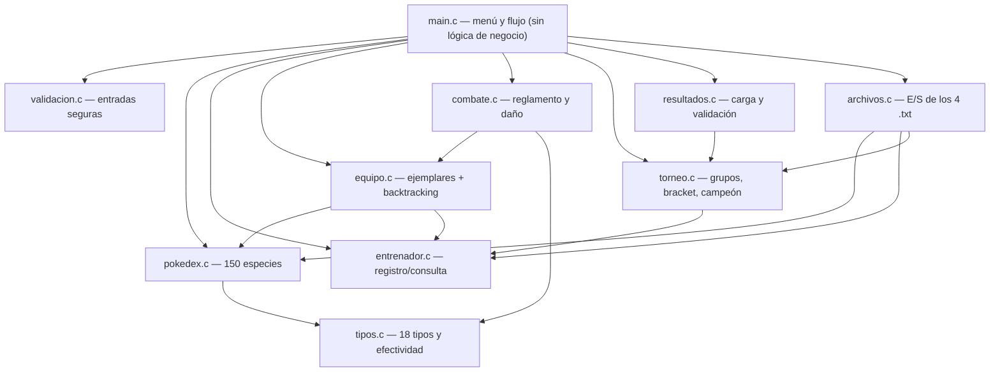
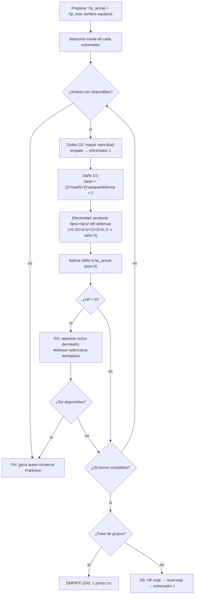
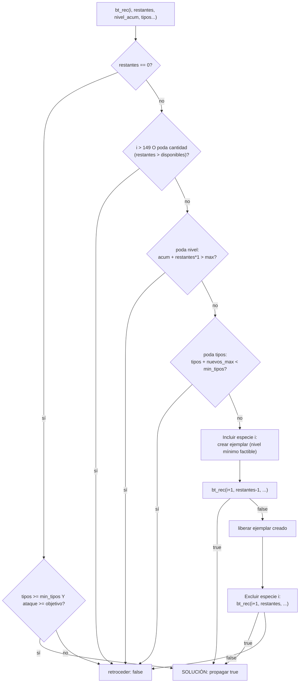
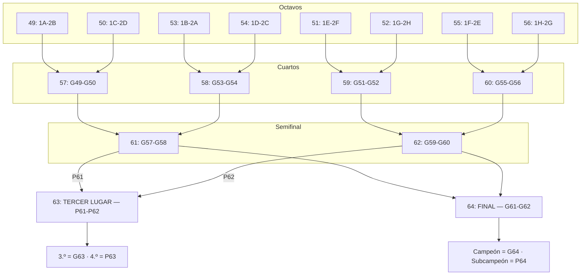

# Informe técnico — El Gran Torneo Pokémon

**Proyecto**: El Gran Torneo Pokémon — Sistema de administración de torneo (Primera Generación)
**Curso**: Programación I / Algoritmos I — Universidad de Carabobo
**Lenguaje**: C (ISO C99) · `gcc -std=c99 -Wall -Wextra` (cero warnings)
**Fecha de inicio**: 2026-09-01 · **Documento**: DOC-03 (spec `documentacion`)

> **Aviso de crecimiento incremental**: este informe se construye fase a fase.
> Esta versión (F0) contiene solo la semilla: portada, índice previsto y la
> sección de arquitectura con los diagramas del diseño. Cada fase posterior
> agrega su sección (decisiones D1–D10 justificadas, formatos de archivo,
> verificación y conclusiones) hasta el informe final de F10.

---

## Índice previsto

1. Introducción y objetivos
2. Arquitectura del sistema (diagramas de módulos y flujos)
3. Decisiones de diseño D1–D10 (justificación para la defensa oral)
4. Algoritmos (recursividad + backtracking de formación de equipos)
5. Formatos de los archivos de texto (`data/*.txt`)
6. Estrategia de verificación (batería scriptada)
7. Requisitos técnicos del enunciado (funciones, structs, TDA, archivos, cadenas)
8. Conclusiones y trabajo futuro

*(Las secciones 3 a 8 se completan en las fases F1–F10.)*

---

## 2. Arquitectura del sistema

El sistema se organiza en 10 módulos más `main`. `main` solo orquesta el menú y
el flujo (RF-TEC-02); cada módulo tiene una responsabilidad única y las
dependencias solo apuntan "hacia abajo" (sin ciclos entre cabeceras).

### 2.1 Mapa de módulos y dependencias

### 2.2 Flujo de combate (D1, D3, D4, D5)

El combate 1 vs 1 es determinista: sin azar en ninguna ruta. El daño usa la
fórmula cerrada D1 con el multiplicador de tipos; el empate por límite de turnos
se resuelve distinto en grupos (D4) y en eliminatoria (D5).

### 2.3 Backtracking de formación de equipos (RF-EQP-04)

La formación automática explora combinaciones de especies con podas tempranas
(cantidad, nivel total, tipos alcanzables) y propaga la primera solución.

### 2.4 Torneo y eliminatorias (bracket 49–64)

Fase de grupos round-robin (combates 1–48) y eliminatorias con bracket de mapeo
fijo (49–64). Los participantes los resuelve el sistema, nunca el usuario
(RF-RES-03).

---

## 3. Decisiones de diseño (D1–D10)

*Se completa en F10* (tarea F10.1). Las decisiones quedan cerradas y justificadas
en `openspec/changes/gran-torneo-pokemon/design.md` §3 para la defensa oral.

**Decisiones pendientes del docente** (afectan a D7, D6 y D9; ver
`docs/planificacion.md` §4): rango de niveles 1–50 vs 1–100, equipo de torneo 3 vs 6
y confirmación del criterio adicional de desempate D9.