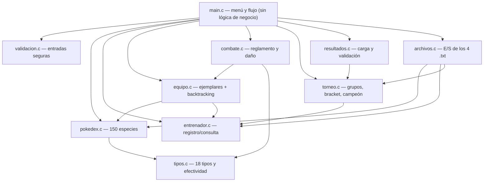
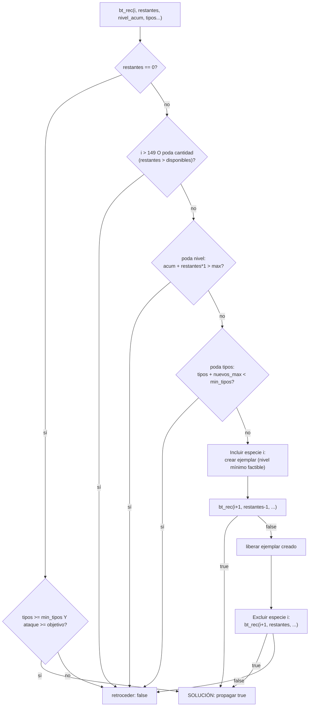
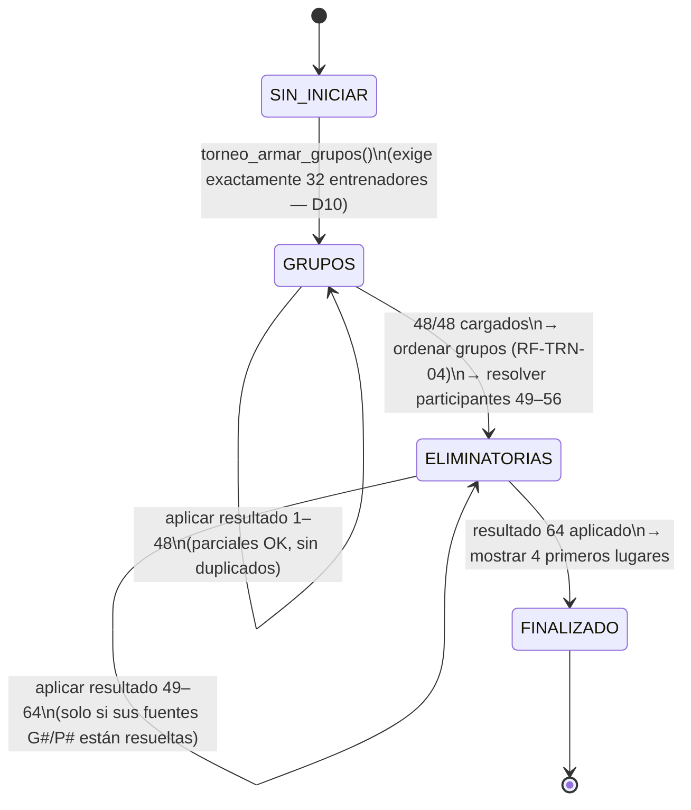
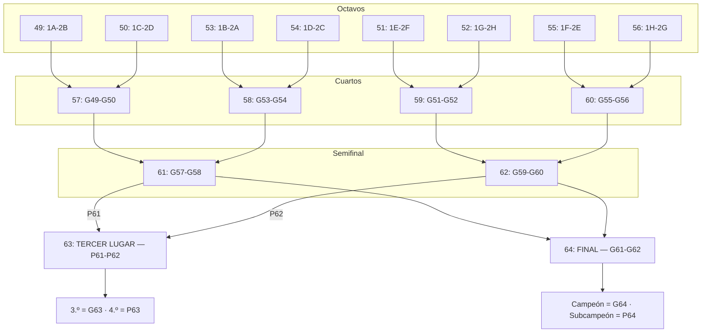
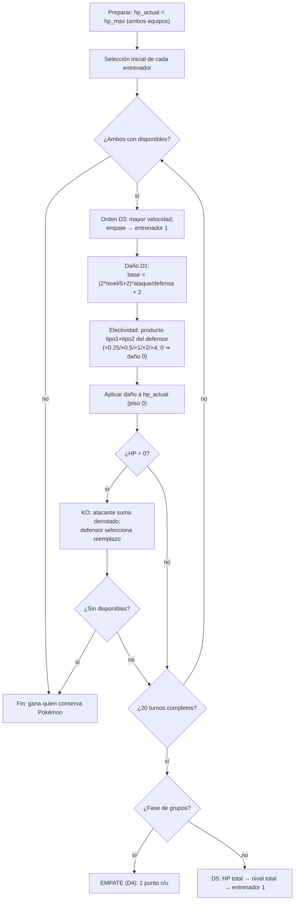

# Diseño: Gran Torneo Pokémon

**Change**: `gran-torneo-pokemon`
**Fase**: sdd-design
**Fecha**: 2026-09-01
**Idioma del artefacto**: español neutro y profesional (requisito explícito del proyecto)
**Entradas**: `proposal.md`, `specs/` (11 capacidades), `exploration.md` (decisiones D1–D10)
**Restricciones**: C99, `gcc -std=c99 -Wall -Wextra` (cero warnings), consola stdin/stdout, sin framework de tests (verificación scriptada stdin→stdout→diff), sin valgrind.

---

## Enfoque técnico

Sistema de consola en C99 organizado en **10 módulos + `main`**, con `main` limitado a menú y flujo (RF-TEC-02). El estado del sistema se concentra en tres agregados de datos (Pokédex, registro de entrenadores, torneo) que los módulos manipulan mediante funciones públicas declaradas en cabeceras. La separación **especie/ejemplar** (sección 5 del PDF, criterio central de evaluación) se materializa en dos structs independientes: `Especie` (inmutable, cargada de archivo) y `Ejemplar` (mutable, con copia derivada de stats). El torneo es una **máquina de estados determinista**: combates 1–48 (grupos, round-robin fijo) → clasificación por desempates ordenados → combates 49–64 (bracket de mapeo fijo por tabla). Toda decisión abierta del PDF (D1–D10) queda cerrada aquí con rationale defendible en la evaluación oral, y se documenta en el informe técnico incremental (`docs/informe-tecnico.md`) con los diagramas Mermaid de este documento como semilla.

Principios transversales:

1. **Determinismo total**: sin `srand` ni azar en ninguna ruta (D2 y D3/D5 deterministas) → `diff` reproducible en la batería scriptada.
2. **Arreglos estáticos donde el dominio está acotado** (150 especies, 32 entrenadores, 64 combates, matriz 18×18); **memoria dinámica solo donde el requisito la exige** (equipo como lista enlazada de `Ejemplar`, TDA del curso).
3. **Nada de lógica de negocio en `main`**: cada opción del menú delega en un módulo; `main` solo muestra, lee (vía `validacion`) y despacha.
4. **Los participantes de cada combate los resuelve el sistema, nunca el usuario** (RF-RES-03): el bracket es una tabla estática de fuentes.

---

## 1. Arquitectura de módulos

### 1.1 Mapa de módulos y dependencias



Regla arquitectónica: **las dependencias solo van "hacia abajo"** (main → módulos → soporte), sin ciclos entre cabeceras (`equipo.h` es autónomo; `entrenador.h` incluye `equipo.h`; nadie incluye `main.h` porque no existe).

### 1.2 Contrato por módulo

| Módulo | Responsabilidad única | Depende de |
|---|---|---|
| `main.c` | Bucle del menú (12 opciones, RF-MEN-01), carga inicial de datos, despacho de opciones. **Prohibido**: cálculo de daño, reglas de torneo, validaciones de dominio, E/S de archivos. | todos (solo orquestación) |
| `pokedex.c/h` | Cargar las 150 especies desde `data/pokedex.txt`, consulta por número/nombre, mostrado. Inmutabilidad garantizada (todas las API reciben `const Pokedex *`). | `tipos` |
| `tipos.c/h` | Enum de 18 tipos, conversión texto↔enum, matriz `float[18][18]` de efectividad y producto sobre dos tipos (RF-CMB-05). | — |
| `entrenador.c/h` | Registro con id único (RF-ENT-02), búsqueda, listado; el struct `Entrenador` porta su equipo y sus contadores de fase de grupos. | `equipo` |
| `equipo.c/h` | Creación de ejemplares desde especie (D2), agregación con validación de tamaño (RF-EQP-05), validación de equipo y **formación automática por recursividad+backtracking** (RF-EQP-04). | `pokedex`, `entrenador` |
| `combate.c/h` | Reglamento del combate 1 vs 1 (RF-CMB-01..05): orden por velocidad (D3), fórmula de daño (D1), KO y reemplazo, fin y empate (D4/D5). Devuelve el resultado; **no** lo registra. | `equipo`, `tipos` |
| `torneo.c/h` | Estado del torneo: distribución en grupos A–H, calendario 1–48, puntuación 3/1/0, ordenamiento de clasificación (RF-TRN-04), resolución de participantes 49–64 (tabla de bracket), posiciones finales. | `entrenador` |
| `resultados.c/h` | Entrada de resultados por teclado o archivo (RF-RES-01/04), validación completa (RF-RES-02) y delegación de la aplicación del resultado al estado del torneo. | `torneo`, `validacion` |
| `archivos.c/h` | Único punto de E/S de texto (además de la carga de la Pokédex en su módulo): entrenadores, resultados, clasificación (D8). | `pokedex`, `entrenador`, `torneo` |
| `validacion.c/h` | Lectura segura y reintentos: enteros en rango, cadenas, ids, niveles, opciones de menú. Garantía RF-TEC-03: ninguna entrada inválida termina el programa. | — |
| `constantes.h` | Constantes de dominio en un solo lugar (`MAX_EQUIPO`, `NIVEL_MAX`, `MAX_ENTRENADORES`, `TOTAL_COMBATES`, `MAX_TURNOS_COMBATE`, tamaños de buffer). | — |

### 1.3 Interfaces públicas clave (firmas de cabecera)

```c
/* ---------- pokedex.h ---------- */
bool pokedex_cargar(Pokedex *pd, const char *ruta);          /* 150 líneas estrictas */
const Especie *pokedex_buscar_numero(const Pokedex *pd, int numero);
const Especie *pokedex_buscar_nombre(const Pokedex *pd, const char *nombre);
void pokedex_mostrar_todas(const Pokedex *pd);
void pokedex_mostrar_especie(const Especie *esp);

/* ---------- tipos.h ---------- */
bool  tipos_es_valido(const char *nombre, Tipo *salida);      /* "Planta"→enum; "-"→TIPO_NINGUNO */
const char *tipos_a_texto(Tipo t);
void  tipos_inicializar(void);                                /* fija la matriz 18x18 */
float tipos_multiplicador(Tipo ataque, Tipo def1, Tipo def2); /* producto de ambos tipos del defensor */

/* ---------- entrenador.h ---------- */
bool entrenador_registrar(RegistroEntrenadores *reg, int id, const char *nombre); /* id único */
Entrenador *entrenador_buscar(RegistroEntrenadores *reg, int id);
void entrenador_mostrar_todos(const RegistroEntrenadores *reg);

/* ---------- equipo.h ---------- */
Ejemplar *equipo_crear_ejemplar(const Especie *esp, int nivel, const char *apodo, int id);
bool equipo_agregar_ejemplar(Entrenador *ent, Ejemplar *nuevo);      /* respeta MAX_EQUIPO */
bool equipo_validar(const Entrenador *ent, int tamano_requerido);    /* RF-EQP-05 */
bool equipo_formar_backtracking(const Pokedex *pd, const RestriccionesEquipo *r,
                                Ejemplar **salida, int *cantidad);   /* RF-EQP-04 */

/* ---------- combate.h ---------- */
int  combate_calcular_danio(const Ejemplar *atacante, const Ejemplar *defensor);
bool combate_ataca_primero(const Ejemplar *local, const Ejemplar *visita);   /* D3 */
bool combate_ejecutar(Entrenador *local, Entrenador *visita, ResultadoCombate *res);

/* ---------- torneo.h ---------- */
bool torneo_armar_grupos(Torneo *t, const RegistroEntrenadores *reg);        /* exige 32 (D10) */
void torneo_participantes(const Torneo *t, int numero, int *id1, int *id2);  /* RF-RES-03 */
bool torneo_aplicar_resultado(Torneo *t, RegistroEntrenadores *reg,
                              const ResultadoCargado *r, char *msg, size_t n);
void torneo_ordenar_grupos(Torneo *t);                       /* criterios RF-TRN-04 */
void torneo_mostrar_posiciones_finales(const Torneo *t);     /* campeón, 2.º, 3.º, 4.º */

/* ---------- resultados.h ---------- */
bool resultados_cargar_teclado(Torneo *t, RegistroEntrenadores *reg);
bool resultados_cargar_archivo(Torneo *t, RegistroEntrenadores *reg, const char *ruta);

/* ---------- archivos.h ---------- */
bool archivos_guardar_entrenadores(const RegistroEntrenadores *reg, const char *ruta);
bool archivos_cargar_entrenadores(RegistroEntrenadores *reg, const Pokedex *pd, const char *ruta);
bool archivos_cargar_resultados(Torneo *t, RegistroEntrenadores *reg, const char *ruta);
bool archivos_guardar_clasificacion(const Torneo *t, const char *ruta);

/* ---------- validacion.h ---------- */
int  validar_leer_entero(const char *mensaje, int min, int max);   /* reintenta indefinidamente */
void validar_leer_cadena(const char *mensaje, char *buf, size_t n);
```

---

## 2. Estructuras de datos exactas en C

```c
/* ---------- tipos.h ---------- */
typedef enum {
    TIPO_NORMAL, TIPO_FUEGO, TIPO_AGUA, TIPO_PLANTA, TIPO_ELECTRICO,
    TIPO_HIELO, TIPO_LUCHA, TIPO_VENENO, TIPO_TIERRA, TIPO_VOLADOR,
    TIPO_PSIQUICO, TIPO_BICHO, TIPO_ROCA, TIPO_FANTASMA, TIPO_DRAGON,
    TIPO_SINIESTRO, TIPO_ACERO, TIPO_HADA,
    TIPO_NINGUNO   /* segundo tipo ausente y tipo de sentinela */
} Tipo;

/* Matriz estática: efectividad[i][j] = multiplicador del tipo i (atacante)
   contra el tipo j (defensor). Valores: 0.0f, 0.5f, 1.0f, 2.0f. */
static float efectividad[CANT_TIPOS][CANT_TIPOS];   /* 18 x 18 = 324 floats ≈ 1.3 KB */

/* ---------- pokedex.h ---------- */
typedef struct {
    int  numero;                 /* 1..150 */
    char nombre[16];             /* el nombre más largo ("Farfetch'd") ocupa 10 */
    Tipo tipo_primario;
    Tipo tipo_secundario;        /* TIPO_NINGUNO si la especie es de un solo tipo */
    int  hp_base, ataque_base, defensa_base, velocidad_base;
} Especie;

typedef struct {
    Especie especies[POKEDEX_MAX];   /* POKEDEX_MAX = 150, arreglo estático */
    int     cantidad;                /* 150 tras una carga exitosa; 0 si falló */
} Pokedex;

/* ---------- equipo.h ---------- */
typedef struct Ejemplar {
    int   id;                    /* único global, monótono */
    int   numero_especie;        /* 1..150 — referencia, NO copia propietaria */
    char  nombre[16];            /* apodo del ejemplar */
    int   nivel;                 /* NIVEL_MIN..NIVEL_MAX */
    int   hp_max, ataque, defensa, velocidad;   /* derivados de la especie (D2) */
    int   hp_actual;             /* ÚNICO campo que muta en combate */
    Tipo  tipo_primario, tipo_secundario;       /* copia: combate no consulta la Pokédex */
    struct Ejemplar *siguiente;  /* TDA lista enlazada del equipo */
} Ejemplar;

typedef struct {                 /* restricciones del backtracking (RF-EQP-04) */
    int  cantidad;               /* n buscado, 1..MAX_EQUIPO */
    int  nivel_total_max;
    int  min_tipos;              /* tipos distintos mínimos */
    int  ataque_total_min;       /* opcional (stats objetivo); 0 = sin restricción */
    bool permitir_repetidas;     /* especies repetidas dentro del equipo */
} RestriccionesEquipo;

/* ---------- entrenador.h ---------- */
typedef struct {
    int   id;                    /* único (RF-ENT-02) */
    char  nombre[32];
    int   victorias, empates, derrotas;
    int   puntos;                /* 3/1/0 solo fase de grupos */
    int   pokemon_derrotados;    /* criterio 3 de desempate (RF-TRN-04) */
    Ejemplar *equipo;            /* cabeza de la lista enlazada */
} Entrenador;

typedef struct {
    Entrenador entrenadores[MAX_ENTRENADORES];  /* 32, arreglo estático */
    int cantidad;
} RegistroEntrenadores;

/* ---------- torneo.h ---------- */
typedef enum { TORNEO_SIN_INICIAR, TORNEO_GRUPOS, TORNEO_ELIMINATORIAS,
               TORNEO_FINALIZADO } EstadoTorneo;
typedef enum { RES_V1, RES_V2, RES_EMPATE, RES_PENDIENTE } EstadoResultado;

typedef struct {
    int   numero;                /* 1..64 */
    int   id_entrenador1, id_entrenador2;   /* resueltos por el sistema */
    EstadoResultado estado;
    int   id_ganador;            /* id válido; 0 si empate; sin sentido si pendiente */
    int   kos1, kos2;            /* Pokémon derrotados (criterio 3 de RF-TRN-04) */
} Combate;

typedef struct {
    EstadoTorneo estado;
    Combate combates[TOTAL_COMBATES];      /* 64, arreglo estático, índice = numero-1 */
    int  id_clasificados[16];              /* orden: 1A,2A,1B,2B,...,1H,2H */
} Torneo;

/* ---------- combate.h ---------- */
typedef struct {
    bool empate;
    int  id_ganador;
    int  kos_local, kos_visita;
} ResultadoCombate;
```

### 2.1 Rationale de cada elección contra los requisitos técnicos (RF-TEC-01)

| Requisito del PDF (punto 3) | Dónde se cumple en este diseño | Por qué aquí y no en otra parte |
|---|---|---|
| Funciones | Toda la lógica está en funciones de módulo; `main` solo despacha | RF-TEC-02 prohíbe concentrar lógica en `main` |
| Estructuras (`struct`) | `Especie`, `Ejemplar`, `Entrenador`, `Combate`, `Torneo`, `RestriccionesEquipo` | Un struct por concepto del dominio; separan inmutable (especie) de mutable (ejemplar) |
| Arreglos | `especies[150]`, `entrenadores[32]`, `combates[64]`, `efectividad[18][18]` | Dominios acotados por el enunciado: tamaño conocido ⇒ estático, sin riesgo de fugas |
| Estructuras dinámicas | Equipo como lista enlazada de `Ejemplar` (`malloc`/`free` disciplinados) | Único agregado de tamaño variable real (1–6 por entrenador); el PDF exige demostrarlo |
| Manejo de archivos | `pokedex_cargar` + `archivos.c` (los 4 `.txt`) | Los 150 Pokémon NO viven en el código (1.14); resultados y clasificación persisten |
| Cadenas | Nombres/apodos con `char[]`, `fgets`+`strtok`, `strcmp`/`strncpy` en búsquedas | Búsqueda por nombre (RF-PDX-05) y parseo de archivos ejercitan cadenas |
| TDA | Lista enlazada del equipo con encapsulamiento (solo `equipo.c` toca `siguiente`) | TDA estudiado en el curso; la mutación queda encapsulada |
| Recursividad + backtracking | `equipo_formar_backtracking` (§4) | Requisito explícito 1.5 y criterio de evaluación |

### 2.2 Decisiones de diseño de datos (con rationale)

| Decisión | Elección | Alternativa descartada | Rationale |
|---|---|---|---|
| Pokédex estática | `Especie especies[150]` | Lista dinámica o tabla hash | 150 es fijo por enunciado (RF-PDX-01); el acceso por índice directo `especies[numero-1]` es O(1) y el arreglo demuestra "arreglos" (RF-TEC-01); una tabla hash agrega complejidad no exigida |
| `Ejemplar` referencia a especie por `numero` | `int numero_especie` | Puntero `const Especie *` | El puntero puede colgar tras recargar la Pokédex; el número es serializable a archivo y obliga a resolver la especie explícitamente cuando se necesita |
| Tipos copiados en `Ejemplar` | Sí, dos `Tipo` | Consultar especie en cada golpe | El combate queda desacoplado de la Pokédex: imposible en la práctica mutar la especie (RF-PDX-04) y menos indirección en el bucle caliente |
| Equipo = lista enlazada | `Ejemplar *` con `siguiente` | Arreglo estático `Ejemplar[6]` | El PDF exige TDA + estructuras dinámicas; el tamaño válido varía (1–6) y los ejemplares se crean/destruyen individualmente; el recorrido en combate es secuencial natural |
| Entrenadores estáticos `[32]` | Sí | Lista dinámica | D10: el torneo exige exactamente 32; el límite de registro es conocido; elimina `malloc` en el camino más usado |
| `Combate` indexado por número | `combates[64]`, índice `numero-1` | Diccionario/lista | La numeración 1–64 es fija por reglamento; el acceso directo simplifica la validación "combate inexistente" y las búsquedas de G#/P# |
| KOs dentro de `Combate` | `kos1`, `kos2` | Recalcular desde simulaciones | El criterio 3 de desempate (RF-TRN-04) necesita "Pokémon derrotados en fase de grupos"; con resultados cargados por archivo la simulación no existe ⇒ debe persistirse |
| `float` en efectividad | `float[18][18]` con {0, 0.5, 1, 2} | `int` en promille o enum | El spec exige multiplicadores 2/1/0.5/0 (RF-CMB-03); `float` los representa exactamente y el producto de dos tipos (×0.25/×4) es directo |

---

## 3. Decisiones cerradas D1–D10 (rationale para la defensa oral)

| # | Decisión | Elección cerrada | Alternativas consideradas | Rationale defendible |
|---|---|---|---|---|
| **D1** | Fórmula de daño | `base = (2*nivel/5 + 2) * ataque / defensa + 2` (enteros, en ese orden); `mult = tipos_multiplicador(tipo_primario_del_atacante, tipo1_def, tipo2_def)`; `daño = (int)(base * mult)`; si `mult > 0` y `daño < 1` ⇒ `daño = 1`; si `mult == 0` ⇒ `daño = 0` | Fórmula oficial 1.ª gen completa `/50` (descartada, ver abajo); con poder de movimiento (fuera de alcance) | Usa el mínimo exigido (nivel, ataque, defensa, tipo atacante, tipo(s) defensor — RF-CMB-03). **Nota clave**: se elimina el `/50` de la fórmula oficial porque ese término acompaña al poder del movimiento, y los movimientos están fuera de alcance; sin él, el daño a nivel 50 contra stats derivadas de base 45–80 es ≈2 por golpe y ningún combate terminaría antes del límite de turnos (todo sería empate). Con la variante cerrada: daño ≈ 24 vs HP ≈ 105–140 a nivel 50 (4–6 golpes), ×2 ⇒ 2–3 golpes, ×0.5 ⇒ 8–12: combates de ~6–16 turnos, dentro del límite de 20. Multiplicador del **tipo primario** del atacante: al no existir movimientos, el tipo primario es el identificador natural de la especie. Mínimo 1 si hay efecto: evita el estancamiento total |
| **D2** | Stats del ejemplar | `hp_max = (hp_base * nivel / 50) + nivel + 10 + variacion`; `stat = (stat_base * nivel / 50) + nivel + 5 + variacion` para ataque, defensa y velocidad; `variacion(ejemplar) = (id_ejemplar * 7) % 16` → entero determinista en [0,15], **un único valor por ejemplar** aplicado a las 4 stats (división entera truncada); `hp_actual = hp_max` al crear y al iniciar cada combate | Fórmula con variación ±15 % y `srand(fija)` (exploración); fórmulas oficiales con IVs | El +10 para HP y +5 para el resto sigue la forma canónica; el docente solo fijó el ejemplo del HP; el factor de variación cubre la variabilidad pedida sin IVs/EVs; al ser determinista por id, dos ejemplares de la misma especie normalmente difieren y la batería `diff` es 100 % reproducible |
| **D3** | Desempate por velocidad | Igual velocidad ⇒ ataca primero el ejemplar del **entrenador 1** del enfrentamiento | Moneda aleatoria; comparación de id de ejemplar | Determinista y reproducible (exigencia de la verificación scriptada); el spec RF-CMB-02 lo fija literalmente |
| **D4** | Empate en fase de grupos | `MAX_TURNOS_COMBATE = 20`; un **turno = intercambio completo** (ambos activos atacan según orden de velocidad). Al agotar 20 turnos con ambos equipos vivos ⇒ empate: 1 punto por entrenador (RF-TRN-03) | Empate por HP iguales; sin condición de empate (viola la puntuación) | La puntuación 3/1/0 exige que el empate exista; el tope de turnos es la condición más simple, testeable y explicable. Un matchup ×0.25 puede quedar en empate de forma natural |
| **D5** | Anti-empate en eliminatoria | Tras 20 turnos, cadena determinista: 1) mayor **HP total actual** del equipo, 2) mayor **nivel total** del equipo, 3) entrenador 1 | Muerte súbita con daño aleatorio; sorteo | Garantiza exactamente un ganador (RF-ELM-01) sin azar; cada criterio es acumulable y observable en la traza del combate |
| **D6** | Tamaño de equipo | `MAX_EQUIPO = 6` (rango válido de inscripción 1–6, RF-EQP-05); `TAM_EQUIPO_TORNEO = 6`: el torneo combate con el **equipo completo** de hasta 6 (la distinción desaparece); el backtracking acepta cualquier `n` en 1..`MAX_EQUIPO` | Equipo fijo de 6 para todo; equipo fijo de 3 sin rango | El docente dio libertad total de modelado y validó usar el equipo completo: una sola semántica de tamaño (`MAX_EQUIPO`) para inscripción y combate; `TAM_EQUIPO_TORNEO` queda con el mismo valor como alias explícito de la semántica del torneo |
| **D7** | Rango de niveles | `NIVEL_MIN = 1`, `NIVEL_MAX = 100` (canónico; RF-EQP-05 rechaza 0 y 101; ejemplos del PDF: niveles 12 y 15) | 1–50 (rango inicial del spec vigente) | Rango canónico de la franquicia, adoptado con la libertad de modelado otorgada por el docente; acompaña la fórmula D2 (`base × nivel / 50`): a nivel 100 el término de base se duplica y las stats siguen creciendo de forma coherente. Niveles bajos mantienen combates cortos y stats coherentes con bases 45–80 |
| **D8** | Formato de los 4 archivos | Separador `;` uniforme en los 4 archivos; tipo secundario `-`; detalles y parseo en §5 | Espacios en `pokedex.txt` (exploración) | La 1.ª generación incluye nombres con espacio ("Mr. Mime") y apóstrofo ("Farfetch'd"); `;` + `strtok` da un único patrón de parseo para los 4 archivos. El PDF remite explícitamente el formato a la implementación |
| **D9** | Criterio adicional de desempate | 4) **enfrentamiento directo** en fase de grupos entre los empatados (ganador del combate entre ambos; solo comparable dentro del mismo grupo), 5) **id menor** si persiste | Diferencia de HP acumulada; sorteo | Cadena determinista total en RF-TRN-04. **Decidido por el equipo con la libertad de modelado otorgada por el docente** (el PDF lo remitía a él); documentado en `docs/informe-tecnico.md` |
| **D10** | Dimensión del torneo | Exactamente **32 entrenadores** (8 grupos × 4): `torneo_armar_grupos` rechaza cualquier otro conteo | Admitir N múltiplo de 4 | La numeración 49–64 del PDF obliga a 16 clasificados, 8 grupos, 48 combates de grupos (verificación aritmética en exploration §3); sin 32 exactos el bracket por reglamento es imposible |

---

## 4. Algoritmo de backtracking (RF-EQP-04)

### 4.1 Firma y contratos

```c
/* Explora combinaciones de especies hasta cumplir TODAS las restricciones.
   Devuelve true y llena *salida (lista enlazada nueva, propiedad del llamador)
   si existe un equipo válido; false e informe de "no existe solución" si no. */
bool equipo_formar_backtracking(const Pokedex *pd, const RestriccionesEquipo *r,
                                Ejemplar **salida, int *cantidad);

/* Recursión pura sobre el índice de especie (combinaciones, no permutaciones). */
static bool bt_rec(const Pokedex *pd, const RestriccionesEquipo *r, int i,
                   int restantes, int nivel_acum, int tipos_distintos,
                   int ataque_acum, bool tipos_vistos[CANT_TIPOS],
                   Ejemplar **parcial, int *creados);
```

### 4.2 Espacio de estados

- **Estado**: `(i, restantes, nivel_acum, tipos_distintos, ataque_acum, máscara de tipos, equipo parcial)` donde `i` es el índice de especie en curso (0..149).
- **Ramificación**: en cada `i` se decide **incluir la especie `i`** (creando el ejemplar con el nivel mínimo factible dentro del presupuesto restante; si hay objetivo de ataque, se escala el nivel del integrante con mejor base dentro del presupuesto) **o excluirla**.
- **Caso base éxito**: `restantes == 0` AND `tipos_distintos >= min_tipos` AND `ataque_acum >= ataque_total_min` ⇒ primera solución hallada, propagar `true` (satisfacción de restricciones, no optimización: no se busca "el mejor" equipo).
- **Caso base fracaso**: `i > 149` (sin más candidatos).

### 4.3 Podas (corte temprano)

1. **Poda por cantidad**: si `restantes > (POKEDEX_MAX - i)` ⇒ no quedan especies suficientes ⇒ retroceder.
2. **Poda por nivel total (cota inferior)**: cada ejemplar cuesta al menos `NIVEL_MIN = 1`; si `nivel_acum + restantes * NIVEL_MIN > nivel_total_max` ⇒ retroceder. Esta poda es la que hace que "6 Pokémon con nivel total máximo 5" (escenario del spec) fracase de inmediato (6 > 5 en profundidad 1).
3. **Poda por tipos (cota de alcance)**: precomputar `tipos_nuevos_max[i]` = cantidad máxima de tipos nuevos alcanzables usando especies con índice ≥ `i` que no estén en la máscara; si `tipos_distintos + tipos_nuevos_max[i] < min_tipos` ⇒ retroceder.
4. **Restricciones de integrantes**: se aplican al generar el candidato (especie excluida/repetida), nunca dentro de la recursión.
5. **Salida temprana**: primer éxito termina toda la búsqueda.

### 4.4 Sin solución

Si la recursión se agota sin caso base de éxito, `equipo_formar_backtracking` devuelve `false` y la capa de menú informa **"no existe un equipo que cumpla las restricciones indicadas"** sin devolver equipo parcial (spec RF-EQP-04: "no devuelve un equipo inválido"). Los ejemplares creados durante la exploración se liberan al retroceder.

### 4.5 Complejidad esperada y acotación

- **Bruta**: Σ C(150, n) con n = 6 ⇒ C(150,6) ≈ 1,4·10¹⁰ combinaciones — inabordable sin podas.
- **Con podas**: la poda 2 elimina toda rama cuyo presupuesto ya no alcanza; la poda 1 elimina ramas sin candidatos; la poda 3 elimina ramas que ya no pueden alcanzar `min_tipos`. Con las restricciones típicas del dominio (`min_tipos` ≤ 4, `nivel_total_max` ≥ n), **la primera solución aparece en las primeras profundidades**: para `min_tipos = 2` y `n = 3` las primeras 2–3 especies de índices bajos ya cumplen ⇒ milisegundos. El peor caso realista (restricciones casi imposibles pero factibles, p. ej. `min_tipos` alto) sigue acotado por la poda 3 sobre 18 tipos.
- **Costo por nodo**: O(1) además de la creación del ejemplar O(1) (stats derivadas por fórmula).
- **Memoria**: profundidad ≤ n ≤ 6 ejemplares vivos en la rama + tabla sufijo O(18·150).

### 4.6 Diagrama



---

## 5. Formatos exactos de los 4 archivos de texto (D8)

Separador único `;`, UTF-8, sin encabezados, líneas terminadas en `\n`. Regla general de parseo: `fgets` a buffer de 256, recorte de `\r\n`, división con `strtok(buf, ";")`, conteo estricto de campos; cualquier desvío ⇒ mensaje con número de línea (RF-TEC-03, archivo no abrible/malformado) sin terminar el programa.

### 5.1 `data/pokedex.txt` — entrada, 150 líneas exactas

```
001;Bulbasaur;Planta;Veneno;45;49;49;45
004;Charmander;Fuego;-;39;52;43;65
025;Pikachu;Eléctrico;-;35;55;40;90
122;Mr. Mime;Psíquico;Hada;40;45;65;90
150;Mew;Psíquico;-;100;100;100;100
```

| Campo | Significado | Regla |
|---|---|---|
| 1 | NUM | `1..150`, único; se escribe `%03d` y se lee con `atoi` (acepta "001" y "1") |
| 2 | NOMBRE | Sin `;` ni `\n`; puede contener espacios y apóstrofos |
| 3 | TIPO1 | Nombre exacto de los 18 tipos (validar con `tipos_es_valido`) |
| 4 | TIPO2 | Tipo o `-` ⇒ `TIPO_NINGUNO` (RF-PDX-03: tipo único) |
| 5–8 | HP ATQ DEF VEL | Enteros > 0 (bases de la 1.ª generación) |

Parseo estricto: exactamente 8 campos por línea, 150 líneas no vacías; NUM duplicado o fuera de rango ⇒ **se rechaza toda la carga** (la Pokédex queda en `cantidad = 0` y las opciones dependientes avisan "Pokédex no cargada"); el programa continúa (spec RF-PDX-06). **Nunca se escribe sobre este archivo** (RF-PDX-04). Generación: una sola vez en F1 a partir del catálogo oficial de la 1.ª generación y verificada con la prueba de carga (RF-PRB-01).

### 5.2 `data/entrenadores.txt` — entrada/salida, 1 línea por entrenador

```
1;Ash;3;101;1;Bulbi;12;102;25;Sparky;15;103;4;Llama;10
2;Misty;0
```

Esquema: `ID;NOMBRE;CANT;(ID_EJEMPLAR;NUM_ESPECIE;APODO;NIVEL)×CANT`

| Campo | Regla |
|---|---|
| ID | Entero > 0, único en el archivo y contra lo ya registrado (RF-ENT-02) |
| NOMBRE | Sin `;`; espacios permitidos |
| CANT | 0..`MAX_EQUIPO` (6); si 0, la línea termina ahí (entrenador sin equipo) |
| ID_EJEMPLAR | Entero único; al recargar, el contador global de ids se fija al máximo + 1 |
| NUM_ESPECIE | 1..150 y DEBE existir en la Pokédex (RF-EQP-01) |
| APODO | Sin `;` |
| NIVEL | `NIVEL_MIN..NIVEL_MAX`; los stats se **re-derivan** con D2 (no se persisten) |

Registro con campos inválidos ⇒ línea rechazada con mensaje y la carga continúa; al final se reporta aceptados/rechazados. Victorias/empates/derrotas/puntos NO se persisten: se reconstruyen desde `data/resultados.txt` (única fuente de verdad del torneo).

### 5.3 `data/resultados.txt` — entrada, admite parciales

```
1;1;2;V1;1;3;1
7;5;6;E;-;2;2
49;3;9;V2;9;2;3
```

Esquema: `NUM_COMBATE;ID_ENT1;ID_ENT2;RESULTADO;GANADOR;KOS1;KOS2`

| Campo | Regla |
|---|---|
| NUM_COMBATE | 1..64; rechazado si ya tiene resultado (no se edita) |
| ID_ENT1 / ID_ENT2 | DEBEN ser exactamente los participantes resueltos por el sistema para ese número (RF-RES-03); el usuario nunca los inventa |
| RESULTADO | `V1` (gana ENT1), `V2` (gana ENT2), `E` (empate — solo fase de grupos; en 49–64 se rechaza, RF-RES-02) |
| GANADOR | id del ganador, o `-` si `E`; debe coincidir con RESULTADO y pertenecer al combate |
| KOS1 / KOS2 | Pokémon derrotados por cada entrenador (≥ 0; usados por el criterio 3 de RF-TRN-04). Los 5 primeros campos son el mínimo de RF-RES-04: si la línea trae solo 5, KOS = 0 |

Cada línea se valida con `resultados_validar` (catálogo en §8.2); las inválidas se rechazan con mensaje y la carga continúa.

### 5.4 `data/clasificacion.txt` — solo salida (generada)

```
[GRUPO A]
1;5;Misty;3;0;0;9
2;1;Ash;2;0;1;6
3;9;Brock;1;0;2;3
4;14;Jessie;0;0;3;0
```

Esquema por grupo: cabecera `[GRUPO X]` + 4 líneas `POSICION;ID;NOMBRE;VICTORIAS;EMPATES;DERROTAS;PUNTOS`, ordenadas por la cadena completa de RF-TRN-04. No se recarga: es el artefacto de salida de la opción 7 (RF-CLS-01).

---

## 6. Máquina de estados del torneo

### 6.1 Estados y transiciones



- **Distribución de grupos (determinista)**: por orden de registro. Entrenador en posición `k` (0-based) del registro ⇒ grupo `k/4` (0..7 → A..H), puesto `k%4` (0..3).
- **Calendario round-robin (determinista)**: pares fijos por grupo en orden `(m0,m1) (m0,m2) (m0,m3) (m1,m2) (m1,m3) (m2,m3)`; número de combate = `6*grupo + par + 1`. Grupo A: 1–6, B: 7–12, C: 13–18, D: 19–24, E: 25–30, F: 31–36, G: 37–42, H: 43–48. Total 48 ✓ (combates 1–48).
- **Clasificación (RF-TRN-04, orden estricto)**: comparador de ordenamiento: 1) `puntos` desc, 2) `victorias` desc, 3) `pokemon_derrotados` desc, 4) enfrentamiento directo (resultado del combate de grupos entre los dos empatados; solo aplicable dentro del mismo grupo), 5) `id` asc. Clasifican posiciones 1 y 2 de cada grupo ⇒ `id_clasificados[16]` en orden `1A,2A,1B,2B,…,1H,2H` (RF-TRN-06: automático).
- **Participantes resueltos por el sistema (RF-RES-03)**: tabla estática `ORIGEN_PARTICIPANTE[64][2]` con etiquetas `CLASIFICADO(grupo, posición)`, `GANADOR(n)` o `PERDEDOR(n)`; `torneo_participantes()` la resuelve contra el estado real y devuelve error si una fuente aún no existe ("combate no disponible aún").

### 6.2 Tabla de mapeo explícita del bracket 49–64 (para implementación)

| Combate | Ronda | Participante 1 | Participante 2 | Produce |
|---|---|---|---|---|
| 49 | Octavos | 1A | 2B | G49 |
| 50 | Octavos | 1C | 2D | G50 |
| 51 | Octavos | 1E | 2F | G51 |
| 52 | Octavos | 1G | 2H | G52 |
| 53 | Octavos | 1B | 2A | G53 |
| 54 | Octavos | 1D | 2C | G54 |
| 55 | Octavos | 1F | 2E | G55 |
| 56 | Octavos | 1H | 2G | G56 |
| 57 | Cuartos | G49 | G50 | G57 |
| 58 | Cuartos | G53 | G54 | G58 |
| 59 | Cuartos | G51 | G52 | G59 |
| 60 | Cuartos | G55 | G56 | G60 |
| 61 | Semifinal | G57 | G58 | G61 / P61 |
| 62 | Semifinal | G59 | G60 | G62 / P62 |
| 63 | Tercer lugar | P61 | P62 | G63 |
| 64 | Final | G61 | G62 | G64 / P64 |

Posiciones finales: **campeón = G64, subcampeón = P64, tercero = G63, cuarto = P63** (RF-ELM-05).



---

## 7. Flujo de combate paso a paso (RF-CMB-01..05)

1. **Preparación**: restaurar `hp_actual = hp_max` en los 6–ejemplares participantes de ambos equipos (un combate siempre arranca con equipos íntegros).
2. **Selección inicial (RF-CMB-01)**: cada entrenador elige su primer Pokémon (prompt validado por `validacion`; en las pruebas scriptadas la elección llega por stdin).
3. **Ciclo de turno** (contador de intercambios completos, tope `MAX_TURNOS_COMBATE = 20`):
   a. **Orden (RF-CMB-02 / D3)**: ataca primero el activo de mayor `velocidad`; empate ⇒ el del entrenador 1.
   b. **Daño (D1)**: `base = (2*nivel/5 + 2) * ataque / defensa + 2` con `ataque` del atacante y `defensa` del defensor (del ejemplar, nunca de la especie); tipo del ataque = tipo primario del atacante.
   c. **Efectividad (RF-CMB-05)**: `mult = efectividad(tipo_ataque, tipo1_def) * efectividad(tipo_ataque, tipo2_def)` ⇒ ∈ {0.25, 0.5, 1, 2, 4}; `daño = (int)(base*mult)`, mínimo 1 si `mult > 0`, 0 si `mult == 0`.
   d. **Aplicación (RF-CMB-04)**: `hp_actual -= daño` (piso 0). Solo muta el ejemplar — la especie queda intacta (RF-PDX-04).
   e. **KO**: si `hp_actual == 0`: el atacante suma 1 `pokemon_derrotados` (contador de KOs del combate); el defensor elige reemplazo entre sus disponibles (prompt).
4. **Fin por agotamiento**: si un entrenador se queda sin Pokémon disponibles ⇒ gana el otro (quien conserva al menos un Pokémon capaz de continuar).
5. **Fin por límite de turnos (D4/D5)**: al completarse 20 intercambios con ambos equipos vivos: fase de grupos ⇒ **empate**; eliminatoria ⇒ ganador forzoso por cadena: mayor HP total actual del equipo → mayor nivel total → entrenador 1.
6. **Registro**: `combate_ejecutar` devuelve `ResultadoCombate` (empate, ganador, KOs por lado); quien orquesta (main/resultados) lo pasa a `torneo_aplicar_resultado`, que valida, actualiza puntos 3/1/0 (grupos) o avanza G#/P# (eliminatoria), y produce las transiciones de la máquina de estados.



---

## 8. Estrategia de validación (punto 4 del PDF + 1.13)

### 8.1 Catálogo por módulo (RF-TEC-03)

| Validación | Módulo responsable | Mecanismo |
|---|---|---|
| Opción de menú inexistente | `validacion` (`validar_leer_entero(1,12)`) + `main` | Reintenta; nunca `exit` |
| Pokémon inexistente (número o nombre) | `pokedex` (retorna `NULL`) + capa de menú | Mensaje y vuelta al menú |
| Entrenador duplicado / id inválido | `entrenador_registrar` (búsqueda O(n) previa) | Rechazo con mensaje, continúa |
| Nivel inválido (0, > `NIVEL_MAX`) | `validacion` (`validar_leer_entero(NIVEL_MIN, NIVEL_MAX)`) | Repregunta |
| Equipo que excede tamaño | `equipo_agregar_ejemplar` (cuenta la lista; tope `MAX_EQUIPO`) | Rechazo |
| Tipo inválido | `tipos_es_valido` | Repregunta |
| Archivo inexistente / no abrible / malformado | `pokedex_cargar`, `archivos_*` (comprobar `fopen`/campos) | Mensaje con ruta y línea; el programa continúa |
| Combate inexistente (número fuera de 1–64) | `resultados_validar` | Rechazo del registro |
| Entrenador inexistente en resultado | `resultados_validar` (`entrenador_buscar`) | Rechazo |
| Participantes ≠ resueltos por el sistema | `resultados_validar` vs `torneo_participantes` (RF-RES-03) | Rechazo |
| Ronda incorrecta / fuente sin resolver | `torneo_participantes` + estado del torneo | "Combate no disponible aún" |
| Eliminado que reaparece | Implícito: los participantes exigidos son los únicos válidos | Rechazo |
| Ganador fuera de participantes / inconsistente | `resultados_validar` (V1⇒ENT1, V2⇒ENT2) | Rechazo |
| Empate en eliminatoria | `resultados_validar` (`E` solo en 1–48) | Rechazo |
| Resultado duplicado | `resultados_validar` (`estado != RES_PENDIENTE`) | Rechazo |
| 32 entrenadores exactos para armar grupos | `torneo_armar_grupos` (D10) | Rechazo con conteo actual |

Garantía estructural: ninguna función de validación llama a `exit`; todos los bucles de lectura reintentan hasta entrada válida o EOF (EOF ⇒ cierre ordenado).

### 8.2 Patrón de verificación scriptada (sin framework)

- **Batería**: `tests/casos/NNN_descripcion.entrada` + `tests/casos/NNN_descripcion.esperado` (pares versionados). Cada caso es un guion stdin completo (navega el menú y alimenta los prompts).
- **Ejecutor**: `tests/run_tests.sh` compila una vez (`gcc -std=c99 -Wall -Wextra -o build/torneo src/*.c`, cero warnings como gate) y por caso: `./build/torneo < caso.entrada > /tmp/salida.txt` + `diff caso.esperado /tmp/salida.txt`; reporta OK/FALLA por caso y código de salida global.
- **Determinismo**: D2 sin azar, D3/D5 deterministas, distribución y bracket fijos ⇒ cada caso produce exactamente el stdout esperado.
- **Cobertura mínima (RF-PRB-01)**: carga de Pokédex (150 y archivo corrupto), búsquedas existente/inexistente, registro de entrenadores (válido, duplicado, id inválido), creación de ejemplares (niveles válidos/inválidos), formación por backtracking (factible, y el caso "6 Pokémon, nivel total máximo 5" ⇒ sin solución), combate completo con cada multiplicador (2/1/0.5/0 y producto ×4/×0.25), empate por límite de turnos, resultados válidos e inválidos (cada fila de §8.1), clasificación con cada criterio de desempate, avance a eliminatoria, eliminado que reaparece, campeón y cuatro primeros lugares.
- Cada fase debe pasar su batería antes de avanzar (gate por fase, alineado al plan de 14 días).

---

## 9. RF huérfanos — asignación a módulos/capacidades

Los tres RF que la capa de specs reportó sin capacidad propia quedan reclamados así:

| RF | Asignación | Dónde vive y cómo se verifica |
|---|---|---|
| **RF-TEC-01** (funciones, structs, arreglos/dinámicas, archivos, cadenas, TDA, recursividad, backtracking) | Transversal: **todos los módulos** — tabla §2.1 mapea requisito→elemento→módulo | Se cumple por construcción del diseño; se documenta en `docs/informe-tecnico.md` (sección "Requisitos técnicos") y se evidencia en la revisión del código por fase |
| **RF-PRB-01** (batería mínima de pruebas) | Capacidad `documentacion` (plan de control) + estrategia de verificación §8.2 | Casos de `tests/casos/` mapeados 1 a 1 en `docs/planificacion.md` (F10); ejecutados por `tests/run_tests.sh` |
| **RF-PRB-02** (entrega en comprimido) | Fase F11 de `docs/planificacion.md` (capacidad `documentacion`) | Checklist de entrega: `src/*.c`, `*.h`, `main.c`, `data/`, `tests/`, `docs/`, `Doxyfile`; compila y ejecuta sin dependencias externas |

---

## 10. Convención Doxygen obligatoria (DOC-01)

Reglas: bloque de archivo en **todo** `.c`/`.h`; toda función pública con `@brief`/`@param`/`@return`; funciones `static` con comentario breve de una línea; texto en español neutro; identificadores C sin acentos (p. ej. `clasificacion`, `validacion`); ancho máximo 99 columnas; `Doxyfile` con `OUTPUT_LANGUAGE = Spanish`, `INPUT_ENCODING = UTF-8`, `EXTRACT_ALL = YES`.

```c
/**
 * @file pokedex.c
 * @brief Implementación del módulo Pokédex: carga y consulta de las 150 especies.
 * @author <Nombre del estudiante>
 * @date 2026-09-01
 */

/**
 * @brief Busca una especie por su número en la Pokédex.
 *
 * No modifica ningún dato de la Pokédex (RF-PDX-05).
 *
 * @param pd     Puntero a la Pokédex cargada (no debe ser NULL).
 * @param numero Número de especie a buscar, en el rango 1..150.
 * @return Puntero constante a la especie encontrada; NULL si no existe o
 *         los parámetros son inválidos.
 */
const Especie *pokedex_buscar_numero(const Pokedex *pd, int numero);
```

---

## 11. Flujo de datos general

```
data/pokedex.txt ──pokedex_cargar──▶ Pokedex (estática, inmutable)
data/entrenadores.txt ──archivos_cargar──▶ RegistroEntrenadores (32 máx.)
        │                                          │
        │            menú (main) ──lee──▶ validacion.c
        │                                          │
        ├── equipo.c: especie → Ejemplar (D2) → lista enlazada
        ├── combate.c: Ejemplar×Ejemplar → ResultadoCombate (D1/D3/D4/D5)
        ├── resultados.c: teclado/archivo ──valida──▶ torneo.c
        │                                            │
        │                Combate[1..64] + EstadoTorneo + clasificación
        │                                            │
data/resultados.txt ◀──carga──┘                      └──▶ data/clasificacion.txt (salida)
```

---

## 12. Cambios de archivos

| Archivo | Acción | Descripción |
|---|---|---|
| `src/constantes.h` | Crear | Constantes de dominio (`MAX_EQUIPO=6`, `TAM_EQUIPO_TORNEO=6`, `NIVEL_MIN=1`/`NIVEL_MAX=100`, `MAX_ENTRENADORES=32`, `POKEDEX_MAX=150`, `TOTAL_COMBATES=64`, `MAX_TURNOS_COMBATE=20`, buffers) |
| `src/tipos.c` / `src/tipos.h` | Crear | Enum de 18 tipos, matriz 18×18, conversiones y multiplicador |
| `src/pokedex.c` / `src/pokedex.h` | Crear | `Especie`/`Pokedex`, carga estricta de 150 líneas, búsquedas |
| `src/equipo.c` / `src/equipo.h` | Crear | `Ejemplar`, creación (D2), validación de equipo, backtracking |
| `src/entrenador.c` / `src/entrenador.h` | Crear | `Entrenador`/registro (32), id único, búsqueda/listado |
| `src/combate.c` / `src/combate.h` | Crear | Daño D1, orden D3, bucle de combate, empate D4 / anti-empate D5 |
| `src/torneo.c` / `src/torneo.h` | Crear | Grupos, calendario 1–48, clasificación RF-TRN-04, bracket 49–64 |
| `src/resultados.c` / `src/resultados.h` | Crear | Carga teclado/archivo, validación RF-RES-02 |
| `src/archivos.c` / `src/archivos.h` | Crear | E/S de `entrenadores.txt`, `resultados.txt`, `clasificacion.txt` |
| `src/validacion.c` / `src/validacion.h` | Crear | Lectura segura con reintentos (RF-TEC-03) |
| `src/main.c` | Crear | Menú de 12 opciones y flujo; sin lógica de negocio |
| `data/pokedex.txt` | Crear (F1) | 150 líneas reales de la 1.ª generación, formato §5.1; generado y verificado una vez |
| `data/entrenadores.txt` | Crear (F3) | Datos de ejemplo de los 32 entrenadores |
| `data/resultados.txt` | Crear (F8) | Muestra parcial para probar carga de archivo |
| `tests/casos/*`, `tests/run_tests.sh` | Crear (F10) | Batería scriptada entrada/esperado + ejecutor diff |
| `Doxyfile` | Crear (F0) | Configuración Doxygen (salida en español) |
| `docs/planificacion.md`, `docs/informe-tecnico.md` | Crear/Actualizar (F0, incremental) | Control de planificación e informe técnico con los diagramas de este diseño |

No se elimina ni modifica ningún archivo existente (proyecto greenfield; `openspec/` y el PDF no se tocan).

---

## 13. Estrategia de pruebas

| Capa | Qué se prueba | Cómo |
|---|---|---|
| Unitaria (scriptada) | Funciones puras por módulo: `combate_calcular_danio` (cada multiplicador y el mínimo 1), `tipos_multiplicador` (×4 y ×0.25), D2 de stats, comparador de clasificación con cada criterio | Casos de menú dedicados o probes internos activados por opciones de consulta; stdout esperado + `diff` |
| Integración (scriptada) | Torneo completo: 32 entrenadores → 48 resultados de grupos → clasificación con desempates → 49–64 con todas las validaciones → campeón | Un guion stdin que juega el torneo completo; `diff` contra stdout esperado completo |
| E2E (scriptada) | Rutas inválidas: opción 99, nivel 101, id duplicado, resultado de eliminado, empate en 49–64, `pokedex.txt` ausente | Casos con solo entradas inválidas: se verifica que el programa sigue vivo (sigue mostrando el menú en el stdout esperado) |

---

## 14. Matriz de amenazas

N/A — sin enrutamiento, comandos de shell, subprocesos, automatización VCS/PR, clasificación de archivos ejecutables ni integración de procesos: aplicación de consola C99 con E/S por stdin/stdout y archivos de texto locales.

---

## 15. Migración / despliegue

No aplica migración (proyecto greenfield sin datos previos). Aislamiento por fase: cada fase compila limpia y pasa su batería antes de la siguiente; una fase rota se revierte con `git revert` del commit de esa fase (una unidad de commit por fase). `data/pokedex.txt` es de solo lectura para el programa; `clasificacion.txt` es el único artefacto generado de escritura libre. Criterio de aborto del plan (día 12) se gestiona en `docs/planificacion.md`.

---

## 16. Preguntas abiertas — RESUELTAS (2026-09-19)

El docente respondió las tres preguntas abiertas: **libertad total de modelado** (niveles, tamaño de equipo y reglas a conveniencia) y fórmula oficial NO exigida — se admite una fórmula simplificada documentada y validada con el nivel. Las decisiones quedan:

- [x] **Rango de niveles**: **1–100** (canónico). `NIVEL_MAX = 100`; delta de spec aplicado (MODIFIED RF-EQP-05 y su escenario: se rechazan los niveles 0 y 101).
- [x] **Tamaño del equipo de torneo**: **6** — el torneo combate con el equipo completo (`TAM_EQUIPO_TORNEO = 6 = MAX_EQUIPO`); la distinción desaparece (delta menor de spec aplicado).
- [x] **D9**: decidido por el equipo con la libertad otorgada por el docente — enfrentamiento directo + id menor (cadena de 5 criterios de RF-TRN-04); documentado en `docs/informe-tecnico.md`.
